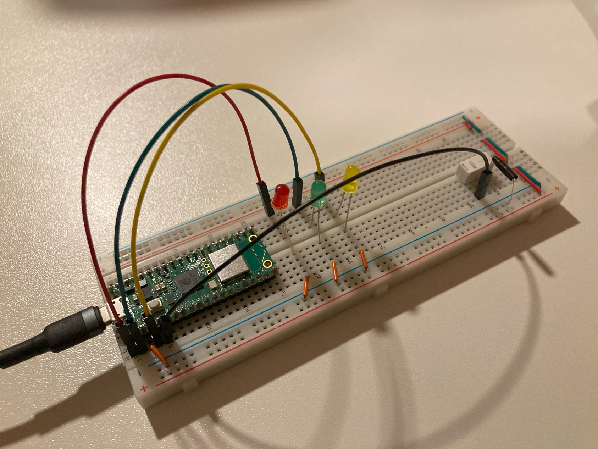

# Raspberry Pi Pico projects
###### _Quick simple projects to get more familiar with uCs._

 

### [LED_Cycling_Polling](https://github.com/r00m3/RPI_Pico_Projects/tree/main/LED_Cycling_Polling)
###### _Learning and testing GPIO basics._
- GPIO_OUT.
- GPIO_IN.
- Pulling up/down.
- Setting drive strength.
- Checking for changes in current.

